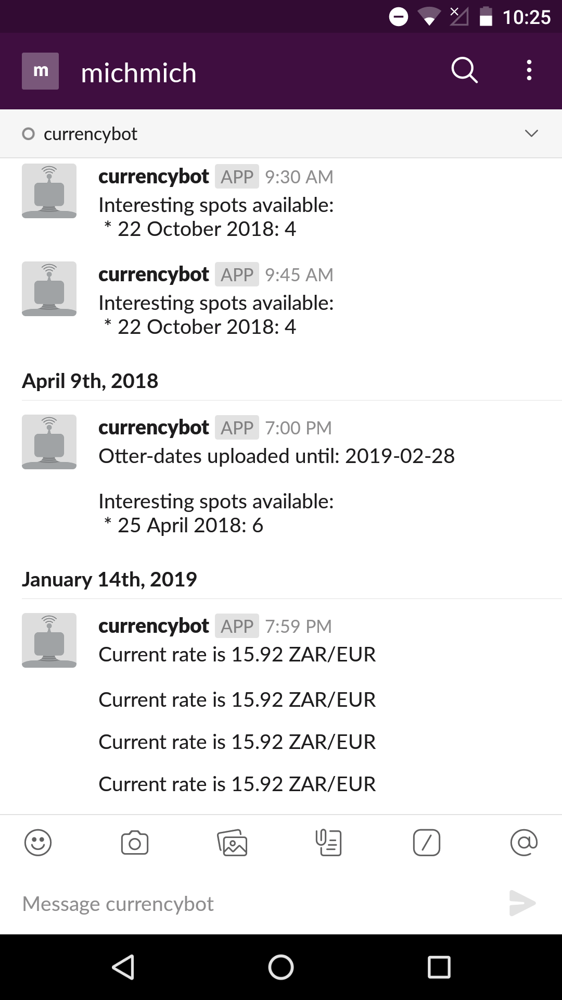
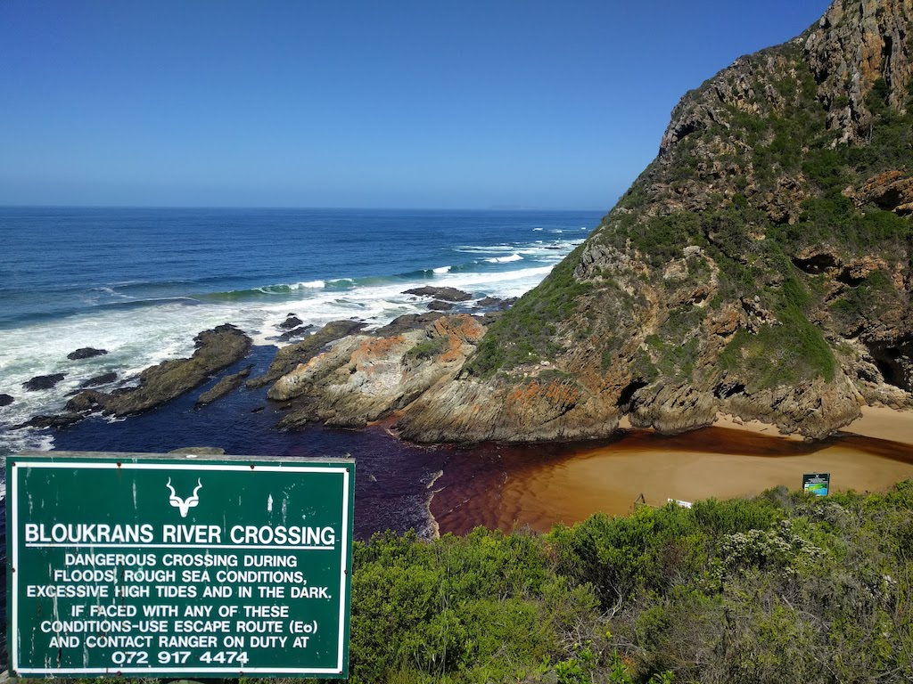

# currency-tracker

This Slack bot can be used to get alerts about events happening on the internet.

I used it for 2 purposes:

* Get notified when new dates for the [Otter-Trail](https://en.wikipedia.org/wiki/Otter_Trail) get available. The latter is often booked one year ahead and available spots get taken in a few hours. We managed to get spots two months ahead for end of January 2018.

## Images

